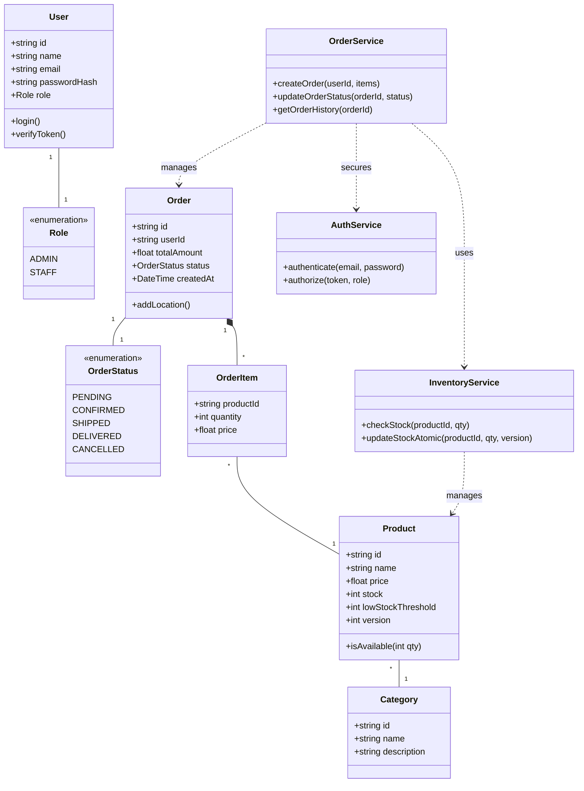

```mermaid
classDiagram

class User {
    +string id
    +string name
    +string email
    +string passwordHash
    +Role role
    +login()
    +verifyToken()
}

class Role {
    <<enumeration>>
    ADMIN
    STAFF
}

class Product {
    +string id
    +string name
    +float price
    +int stock
    +int lowStockThreshold
    +int version
    +isAvailable(int qty)
}

class Category {
    +string id
    +string name
    +string description
}

Product "*" -- "1" Category

class Order {
    +string id
    +string userId
    +float totalAmount
    +OrderStatus status
    +DateTime createdAt
    +addLocation()
}

class OrderStatus {
    <<enumeration>>
    PENDING
    CONFIRMED
    SHIPPED
    DELIVERED
    CANCELLED
}

class OrderItem {
    +string productId
    +int quantity
    +float price
}

class AuthService {
    +authenticate(email, password)
    +authorize(token, role)
}

class InventoryService {
    +checkStock(productId, qty)
    +updateStockAtomic(productId, qty, version)
}

class OrderService {
    +createOrder(userId, items)
    +updateOrderStatus(orderId, status)
    +getOrderHistory(orderId)
}

User "1" -- "1" Role
Order "1" -- "1" OrderStatus
Order "1" *-- "*" OrderItem
OrderItem "*" -- "1" Product
OrderService ..> InventoryService : uses
OrderService ..> AuthService : secures
InventoryService ..> Product : manages
OrderService ..> Order : manages

%% Flow Summary
%% 1. **Modular Architecture**: The system is divided into distinct services (`AuthService`, `InventoryService`, `OrderService`) to decouple concerns.
%% 2. **Secure Authentication**: `AuthService` handles user validation and token issuance, ensuring only authorized `User`s (Admin/Staff) can access specific features.
%% 3. **Atomic Stock Updates**: `InventoryService` uses the `version` field in `Product` to perform optimistic locking, ensuring stock is updated atomically (`updateStockAtomic`) prevents race conditions.
%% 4. **Lifecycle Management**: `Order` tracks its state via `OrderStatus` enumeration, managing the lifecycle from PENDING to DELIVERED.
```
