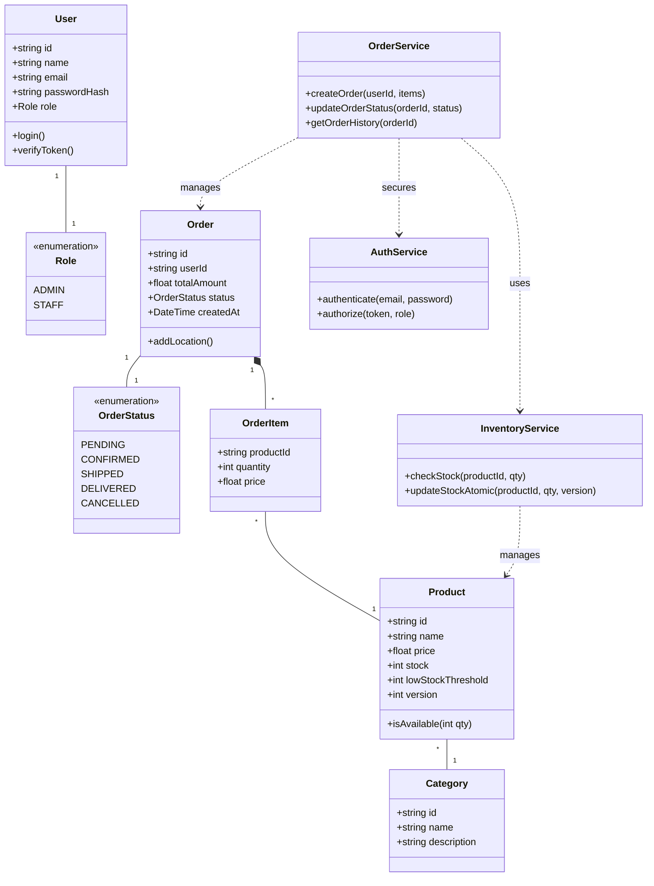

### Flow Summary

| Phase | Description | Key Patterns |
| :--- | :--- | :--- |
| **1. Modular Architecture** | Services (`AuthService`, `InventoryService`, `OrderService`) are decoupled. | **Service Layer Pattern**, **Separation of Concerns** |
| **2. Secure Authentication** | `AuthService` validates tokens; restricts access to `User` roles. | **RBAC**, **Token-Based Auth** |
| **3. Atomic Stock Updates** | `InventoryService` ensures thread-safe stock deduction using `version`. | **Optimistic Locking**, **Atomic Operations** |
| **4. Lifecycle Management** | `Order` state managed via `OrderStatus` (PENDING → DELIVERED). | **State Machine**, **Enum Strategy** |
