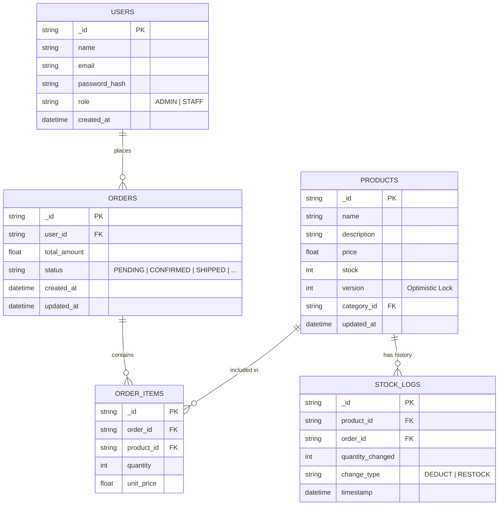

```mermaid
erDiagram

    USERS {
        string _id PK
        string name
        string email
        string password_hash
        string role "ADMIN | STAFF"
        datetime created_at
    }

    PRODUCTS {
        string _id PK
        string name
        string description
        float price
        int stock
        int version "Optimistic Lock"
        string category_id FK
        datetime updated_at
    }

    ORDERS {
        string _id PK
        string user_id FK
        float total_amount
        string status "PENDING | CONFIRMED | SHIPPED | ..."
        datetime created_at
        datetime updated_at
    }

    ORDER_ITEMS {
        string _id PK
        string order_id FK
        string product_id FK
        int quantity
        float unit_price
    }

    STOCK_LOGS {
        string _id PK
        string product_id FK
        string order_id FK
        int quantity_changed
        string change_type "DEDUCT | RESTOCK"
        datetime timestamp
    }

    USERS ||--o{ ORDERS : places
    ORDERS ||--o{ ORDER_ITEMS : contains
    PRODUCTS ||--o{ ORDER_ITEMS : "included in"
    PRODUCTS ||--o{ STOCK_LOGS : "has history"

%% Flow Summary
%% 1. **Data Integrity**: `USERS` table stores hashed passwords (`password_hash`) for security.
%% 2. **Concurrency Control**: `PRODUCTS` table includes a `version` column to support optimistic locking, crucial for atomic stock updates in a high-concurrency environment.
%% 3. **Order Lifecycle**: `ORDERS` table tracks the `status` of an order, supporting lifecycle management queries.
%% 4. **Audit Trail**: `STOCK_LOGS` entity (optional but recommended for robustness) provides a history of all stock changes for accountability.
```
