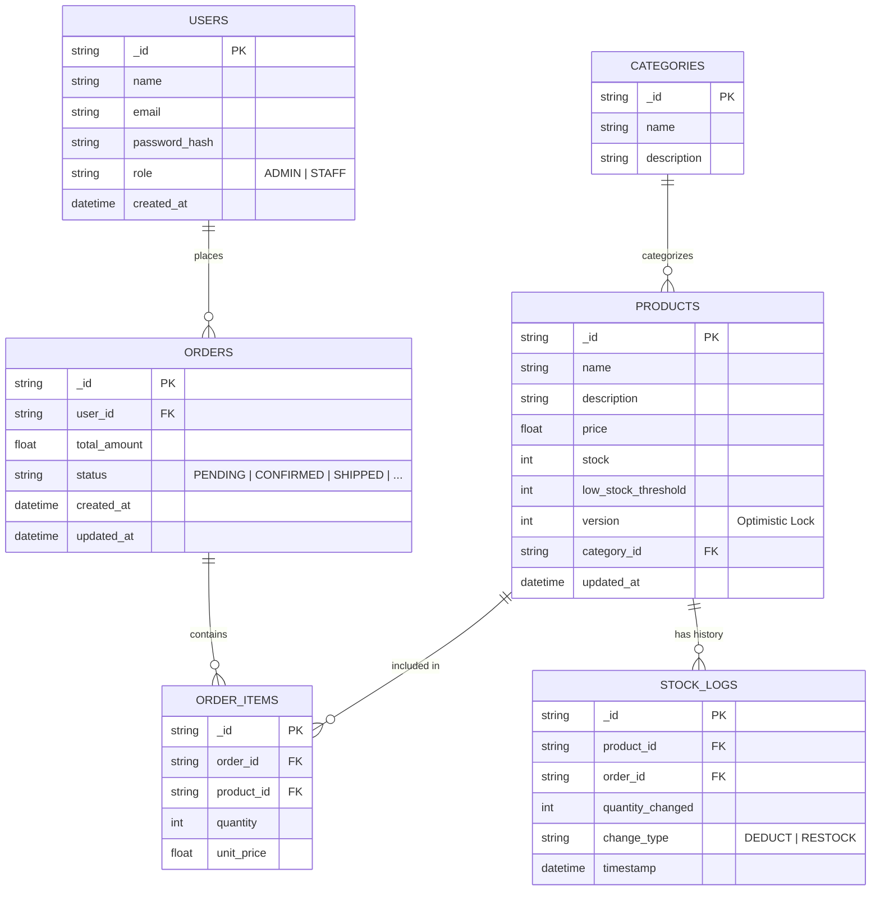

### Flow Summary

| Phase | Description | Key Concepts |
| :--- | :--- | :--- |
| **1. Data Integrity** | `USERS` table stores `password_hash` instead of plain text. | **Hashing**, **Security Best Practices** |
| **2. Concurrency Control** | `PRODUCTS.version` enables optimistic locking for atomic updates. | **Optimistic Locking**, **Versioning** |
| **3. Order Lifecycle** | `ORDERS.status` tracks the progression of an order. | **State Persistence**, **Enum Mapping** |
| **4. Audit Trail** | `STOCK_LOGS` records every stock change for accountability. | **Audit Logging**, **Event Sourcing (Lite)** |
