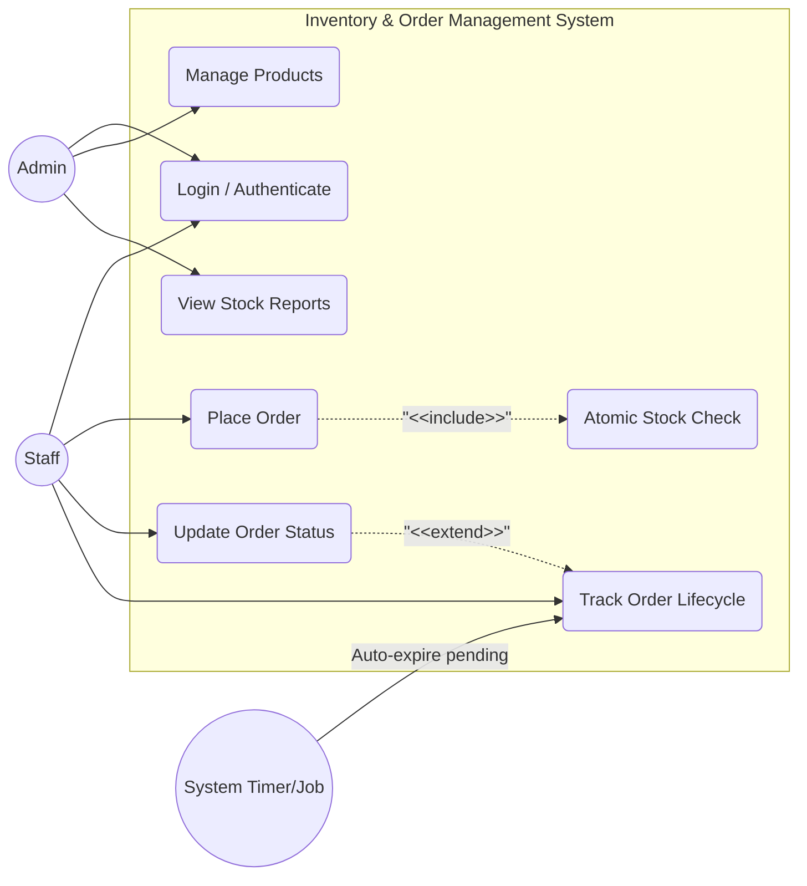

### Flow Summary

| Phase | Description | Key Relationships |
| :--- | :--- | :--- |
| **1. Role-Based Access** | Distinguishes `Admin` (Inventory) and `Staff` (Orders) capabilities. | **Actor Specialization**, **RBAC** |
| **2. Auth First** | All actors must `Authenticate` before accessing any system features. | **Precondition**, **Security Barrier** |
| **3. Process Inclusion** | `Place Order` mandates `Atomic Stock Check` via `<<include>>`. | **<<include>>** (Mandatory) |
| **4. Lifecycle Extension** | `Update Order Status` adds to `Track Order Lifecycle` functionality. | **<<extend>>** (Optional/Add-on) |
